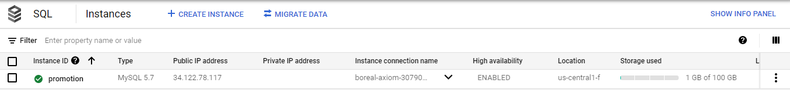
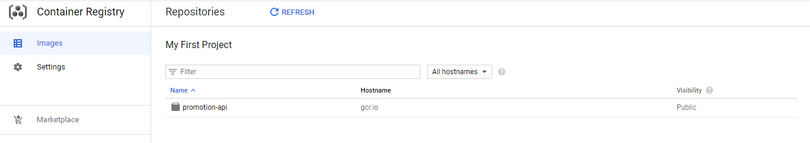
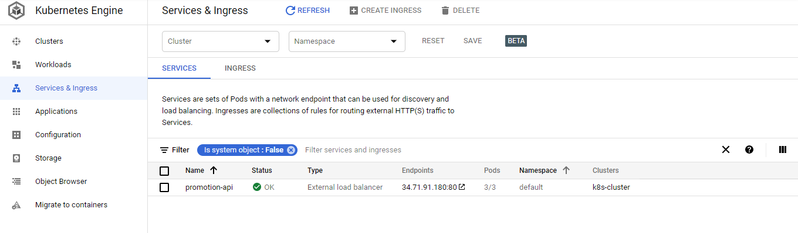

# Promotion API

This API was built during a study of best practices using kotlin and spring boot 

### Requirements

- Java 8 or plus
- Maven
- Docker

### Running application

- With docker imagem 
```sh
#git clone repo
$ git clone https://github.com/juliherms/promotions-api  
#select root directory
$ cd promotion-api
#execute maven build 
$ mvn clean package
#Create basic docker imagem from solution.
$ docker build -t juliherms/promotion-api:v1 .
#Show the created image
$ docker image ls
#Execute docker compose
$ docker-compose -f docker-compose-integrated.yml up
```

- With maven
```sh
#git clone repo
$ git clone https://github.com/juliherms/promotions-api 
#select root directory
$ cd promotion-api
#execute image dependencies (MySQL and Redis)
docker-compose up
#execute whit maven
$ mvn spring-boot:run
```

### Running into CGP Cloud Platform

MySQL Database instance



Container Registry



Google Cloud Kubernetes Platform



